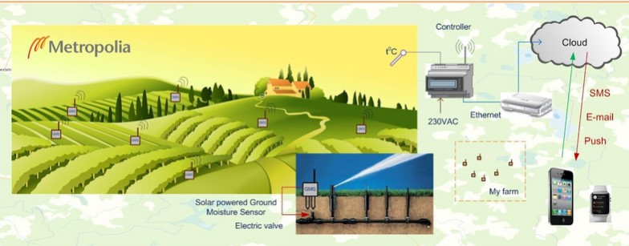

# mizu-ten
IoT project

Problem:

Agricultural business is one of the main water consumption units, an enormous amount of water gets used daily on corps, animals etc. However, not all the water gets to be used properly, a certain amount of water gets wasted each day due to issues like excess plant watering. This is not only ethically wrong, it also makes farmers waste extra money that could be saved.

Solution:

We decided to design a system that would resolve the excess watering by monitoring the soil moisture level and temperature. Our system will have multiple sensors across the entire farm, so that all regions would be monitored. Based on moisture level, the system will decide whether the specific region should be watered. Then it checks the temperature, as if it is low, watering plants can be harmful. If the soil is dry and temperature is decent, the system automatically activates sprays through relays. The farmer can monitor the process through the device. This solution is not only financially beneficial, it is also eco-friendly, which can be really important to some companies. 

Objectives:

Main objective to investigate is the power consumption for device parts. This is significant because the units will be placed across the farm with no access to sockets, which means that we need to use other sources like solar panels or batteries.  

Scope:

We are required to assemble a system that can operate through an entire farm, which area can be many kilometers. For that we need to select a proper communication protocol. Moreover, we need to decide on power management, so that the units can operate efficiently. These are the main things that are required to be investigated, the rest of the components are pretty clear and do not require much investigation

Overview of the project:

# Project requirement
  * Hardware requirement
    Concept: One key device controls or monitors all other devices.
    List of components  needed > (Danil)
     1. Microcontroller > why?
     2. SMD ADAPTER QFP 48  > why?
     3. Temp/humidity sensor  > why?
     4. Solid State Relay   > why? 
     5. Solenoid Valve    > why?    
     6. Wireless module   > why?  
     7. Battery      > why?
     8. ......   
  * Software requirement
     1. C++ IDE, thats controll the system or hardware.
     2. Node++ for Web Application development 
# Project Features 
  How is this system going to work? , What is really in this system ?, what will be the end result for the consumer   (Danil)
  *..........

# Implementation 

# Task 1
  1. Sub Task -> Serch a components for the project (Minh & Andrey)
  2. Sub Task -> Research on multiple components and read Datasheet (Minh & Andrey)
  3. Sub Task -> Select suitable components (Minh & Andrey)
# Task 1 outcome
List of selected components:

Microcontroller      : STM32F0 ARM Cortex-M0 48MHz 64/8KB

SMD ADAPTER          : SMD ADAPTER QFP 48

Temp/humidity sensor : Adafruit 393

Solid State Relay    : CPC1983Y

Solenoid Valve       : Adafruit 997

Wireless module      : RF-LORA-868-SO

Battery         x3   : Z-A 4000JM 

# Task 2
  1. Sub Task -> Create GitHub project (Minh)
  2. Sub Task -> Design readme file and add task outlines (Linga & Andrey)
  3. Sub Task -> Outline results of previous task (Andrey)
  4. Sub Task ->
  5. Sub Task ->

# Task 3

# Task 4
